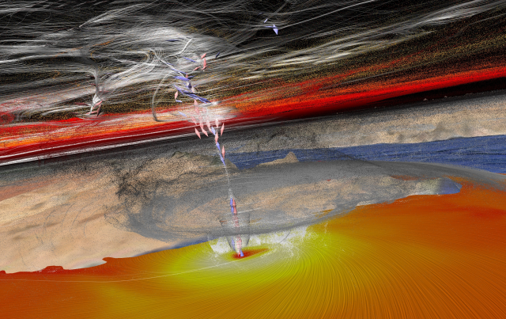

## Background

The [cyclone Chapala](https://en.wikipedia.org/wiki/Cyclone_Chapala), which formed over the Arabian Sea end of October 2015, took advantage of the warmest waters ever recorded in the Arabian Sea and rapidly intensified to a Category 4 storm with 155 mph winds and with a central pressure of 944 hPa. This made Chapala the second strongest tropical cyclone on record in the Arabian Sea, behind Cyclone Gonu in 2007.

It affected as many as 1.1 million people, displacing more than 36,000. The track of this cyclone is also very interesting as it moved into the Gulf of Aden, pushing waters into the Red Sea through the narrow straits of Bab-el-Mandeb. This might have significant impact on the marine-eco system over the Gulf of Aden and the Red Sea.

## Simulation

For the numerical simulation we used [WRF](http://www.wrf-model.org) version 3.7.1. The implemented configuration is composed of two, two-way interactive nested domains with horizontal resolutions of 9 km and 3 km respectively. The vertical column is discretized into 34 vertical levels.

The simulation results are generated on a 1100 × 1000 × 34 regular grid with 138 time steps. Data size for each time step is about 3.1 GB. Therefore, the total size of the generated data set is roughly 428 GB. The simulation was performed in 3 hours using 640 cores on our High Performance Computational Facility [Shaheen II](https://www.hpc.kaust.edu.sa/content/shaheen-ii).

## Visualization

The picture shows the cyclone at the last time step which corresponds to 11 Nov 2015, 5pm. The visualization was done with the [Avizo 3D Visualization Suite](http://www.fei.com/software/avizo3d). It is composed of several components:

- Particles have been advected through the whole time-dependent flow field describing the velocity of the cyclone. White and gray particles in the lower regions emphasize the eye of the cyclone, while red and yellow particles in the higher regions outline the upper spiral movement.

- Critical points (that is, points where the flow field is zero) have been computed. They occur mainly in the eye of the cyclone. A red double-cone indicates an attracting node (a sink) whereas a blue double-cone indicates a repelling saddle node.

- Streamlines (in white) have been seeded from the critical points. They are thus closely following the eye of the cyclone in the lower regions, while resulting in complicated patterns in the higher regions.

- [LIC (line integral convolution)](https://en.wikipedia.org/wiki/Line_integral_convolution) has been used to show the wind in the lower region of the cyclone. Yellow means high and red low velocity.

These visualization components are put on top of a terrain map of the corresponding area of the Arabian Sea.

## References

T. Theußl, H. P. Dasari, I. Hoteit and M. Srinivasan, "[Simulation and visualization of the cyclonic storm chapala over the arabian sea: a case study](http://ieeexplore.ieee.org/abstract/document/7756074/)," 2016 4th Saudi International Conference on Information Technology (Big Data Analysis) (KACSTIT), Riyadh, 2016, pp. 1-6.
